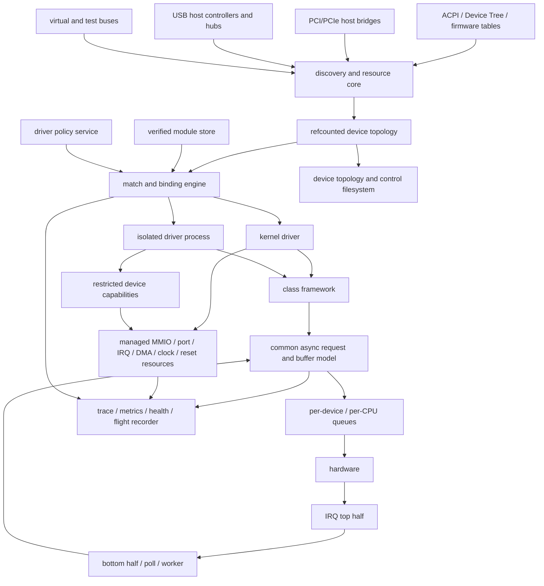
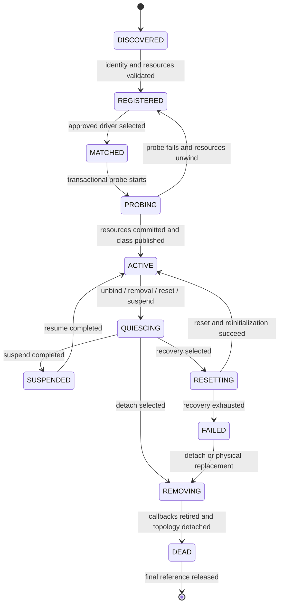

# State-of-the-art device-driver subsystem architecture

Status: target architecture and staged implementation plan. The current kernel does
not yet satisfy these contracts.

Implementation checkpoint (2026-09-02): the compatibility device registry now
provides referenced lookup/put, generation tracking, and
`LIVE -> QUIESCING -> DEAD` retirement. Block flush callbacks execute outside
the registry lock, mounted VFS volumes pin their filesystem and block devices,
mount claims are atomic/serialized, cache identity includes device generation,
and virtio-blk has deterministic reset/drain recovery before descriptor reuse.
Hard IRQ harvest is separated from process-context callback/reclamation work.
These are migration foundations; topology objects, managed resources, IRQ
synchronization, DMA mappings/IOMMU, driver binding, and hotplug remain target
architecture rather than completed capability.

## 1. Purpose

This document defines the target device-driver subsystem for ICS-OS. It covers
PCI/PCIe, USB, storage, networking, graphics/display, AI and other accelerators,
audio, input, platform devices, and virtual devices. It extends the object-lifetime
and asynchronous-request rules in `docs/io-subsystem-modernization-plan.md` into a
general driver model.

The shared unit, KTAP/TAP, QEMU supervision, lifecycle stress, deterministic fault
injection, fuzzing, hardware-lab, CI, and release-qualification framework is
specified in `docs/testing-and-qa-modernization-plan.md`.

The target subsystem must provide:

- automatic discovery, deterministic matching, Plug and Play, and policy-controlled
  binding;
- safe runtime driver load, bind, unbind, replacement, device reset, suspend,
  resume, and physical hotplug without rebooting the operating system;
- bounded fault containment and recovery, including safe failure when hardware is
  inaccessible or cannot be reset;
- scalable asynchronous I/O with per-CPU/per-queue locality, scatter/gather,
  batching, backpressure, cancellation, deadlines, and exactly-once completion;
- a small, typed, versioned driver API with managed resources and mechanically
  testable lifecycle rules;
- production observability from discovery through request completion and recovery;
- architecture-neutral IRQ, DMA, cache-coherency, firmware, and bus APIs suitable
  for x86-64 now and ARM64 later.

“Crash-proof” in this plan means that failures are detected, contained to the
smallest practical recovery domain, reported, and recovered without corrupting
unrelated kernel state. No in-kernel C driver can be made incapable of crashing the
kernel. Complex or untrusted drivers therefore need process isolation and IOMMU
protection in the final design.

## 2. Scope and non-goals

### In scope

- device, bus, driver, class, resource, module, and dependency objects;
- PCI/PCIe, USB, ACPI, Device Tree, and virtual-bus discovery;
- IRQ domains, MSI/MSI-X, threaded handlers, deferred work, and adaptive polling;
- coherent and streaming DMA, scatter/gather, bounce buffering, and IOMMU domains;
- runtime lifecycle, power management, fault recovery, and safe module replacement;
- class frameworks for storage, network, USB, graphics, accelerators, audio, and
  input;
- kernel-mode and user-mode driver execution;
- diagnostics, tracing, metrics, health reporting, crash evidence, virtual hardware,
  and fault injection;
- compatibility adapters for the current DEX device interfaces during migration.

### Not immediate goals

- Linux or Windows binary-driver compatibility;
- arbitrary live patching of executing kernel text;
- stable internal C structure layouts across all future kernels;
- implementing every device class before the lifecycle, IRQ, DMA, and isolation
  foundations are correct;
- claiming production readiness from boot-only or single-vCPU smoke tests.

## 3. Source-grounded current state

### 3.1 Reusable foundations

ICS-OS already contains mechanisms that should be retained or wrapped:

- an atomic `spinlock_t` and SMP scheduler state;
- PCI configuration-space access, standard capability-list parsing, BAR inspection,
  power-capability constants, and MSI definitions;
- a modern virtio-blk transport with MSI-X and callback-based completion;
- legacy ATA/floppy DMA examples and `mmio_mark_uncacheable()`;
- wait queues and scheduler wakeups that can become the basis of completions and
  workqueues;
- PE loader relocation and unload support in one legacy path;
- block, character, graphics, PCI, filesystem, process, and service operation
  tables in the legacy device manager;
- QEMU-based boot, SMP, storage, POSIX-I/O, spawn, and self-host test infrastructure.

These are components, not a unified driver framework.

### 3.2 Verified structural gaps

| Area | Current behavior | Architectural consequence |
|---|---|---|
| Registry | `devmgr_generic` objects are copied into a fixed 255-slot array; lookup returns raw pointers after releasing `devmgr_busy`. | No safe identity, references, parent topology, dependencies, generation checking, or concurrent removal. |
| Locking | Registry and many drivers use non-atomic `sync_sharedvar`; callbacks may execute while the registry lock is held. | SMP races, implicit lock ordering, callback recursion, and deadlock risk. |
| Removal | `devmgr_removedevice()` checks an advisory lock and clears an array slot. | No stop-new-I/O gate, request drain, IRQ synchronization, DMA retirement, child removal, destructor, or final-reference wait. |
| Device APIs | Operation tables use copied function pointers, implicit context, and inconsistent return contracts. | Unsafe unload, no capability negotiation, no ownership rules, and no machine-checkable ABI. |
| PCI | Enumeration is partly database-driven, limited to small fixed arrays, manually sizes BARs, and has no generic `probe`/`remove` binding. | Drivers repeat PCI logic; bridges, resources, hotplug, reset, AER, MSI-X allocation, and policy are not centrally managed. |
| IRQ | Sixteen legacy attachment lists support add but no verified remove/synchronize operation; handlers execute directly in hard IRQ context. | Driver unload and hot removal cannot prove that no handler remains active; long handlers increase latency. |
| USB | UHCI scans and initializes synchronously, uses global static state and buffers, polls transfers, supports one mass-storage path, and has no disconnect lifecycle. | No hub tree, URB ownership, concurrent endpoints, class binding, hotplug, xHCI, or safe surprise removal. |
| Modules | Loader paths have different capabilities; ELF explicitly lacks a complete relocatable linking path, while PE unload does not integrate with device/IRQ/DMA references. | Legacy unload is not safe driver unload. A new module format and ownership protocol are required. |
| DMA | Drivers use physical/identity addresses, static buffers, cache-wide `wbinvd`, or private bounce logic. | No per-device DMA mask, map/unmap ownership, cache maintenance, SG merging, IOMMU isolation, or DMA misuse diagnostics. |
| Deferred work | No general IRQ-safe bottom-half/workqueue framework is used by drivers. | Completion, recovery, enumeration, and teardown either poll or run in unsuitable contexts. |
| Class frameworks | Block interfaces exist, but networking, modern graphics, accelerator, audio, and input frameworks are absent or device-specific. | Each future driver would otherwise invent incompatible queuing, buffer, power, and user APIs. |
| Observability | Mostly ad hoc console/serial text. | No stable topology, binding, request, latency, health, reset, IRQ, DMA, or resource-leak evidence. |

### 3.3 Specific defects to fix before migration

1. Correct the `devmgr_statuslist[i].locked` initialization bug.
2. Correct the exported device-manager `getdevice` function-pointer return type.
3. Never invoke driver callbacks while holding the registry lock or with interrupts
   globally disabled.
4. Replace raw registry pointers with referenced objects before allowing removal.
5. Add IRQ detach and `synchronize_irq()` semantics before runtime module unload.
6. Fix PCI interface initialization that assigns read functions to write slots.
7. Stop database-only PCI discovery from defining which hardware is visible; enumerate
   all functions and use the database only for display names/quirks.
8. Replace USB global buffers and whole-cache `wbinvd` with DMA mappings owned by
   requests.

## 4. Design principles

1. **Devices exist independently of drivers.** Discovery creates a device object;
   matching may bind a driver later, or leave the device unbound.
2. **The core owns lifecycle; drivers implement transitions.** A driver cannot publish
   a device before probe commits and cannot free resources outside ordered teardown.
3. **References, not array membership, establish lifetime.** Every externally used
   object has a referenced lookup protocol and an immutable identity plus generation.
4. **Resources are acquired transactionally.** Probe failure and removal use the same
   reverse-order managed-resource unwind path.
5. **No new operation starts after quiesce begins.** Existing operations finish,
   cancel, or fail exactly once before resources are released.
6. **Interrupt, DMA, timer, and work ownership are explicit.** Teardown has a matching
   synchronous retirement primitive for each asynchronous source.
7. **The fast path is local.** Submission and completion use per-queue/per-CPU data;
   global topology locks are never on the data path.
8. **Isolation is proportional to risk.** Boot-critical/simple drivers may run in the
   kernel; complex and restartable drivers should run in protected driver processes.
9. **Policy is separated from mechanism.** The kernel validates and executes binding,
   power, isolation, and reset; a user policy service selects approved drivers and
   configurable preferences.
10. **Failure is a first-class state.** Every device and request records health,
    timeout, reset, and permanent-failure outcomes.
11. **Compatibility is at adapters, not in the core.** Legacy DEX interfaces remain
    wrappers during migration but do not weaken new lifetime rules.
12. **Measure before tuning.** Numeric throughput and latency gates are derived from
    reproducible baselines, not architectural guesses.

## 5. High-level architecture



### Control plane versus data plane

**Control plane:** discovery, topology changes, matching, binding, firmware,
resource allocation, power transitions, reset, policy, and observability. It may
sleep and is serialized per device or recovery domain.

**Data plane:** request submission, hardware queue access, completion harvesting,
packet/event polling, and user completion publication. It cannot depend on a global
registry lock and must remain operational while unrelated devices are added or
removed.

## 6. Core object model

The following are conceptual contracts, not frozen layouts. Public headers should
use opaque pointers and typed accessors so fields can evolve.

### 6.1 Base object

Every long-lived driver-core object embeds:

```c
struct drv_object {
    u64 object_id;
    u32 generation;
    u16 type;
    u16 flags;
    refcount_t refs;
    spinlock_t state_lock;
    void (*release)(struct drv_object *obj);
};
```

Rules:

- `object_id` is never reused during a boot; user handles contain ID + generation.
- lookup increments `refs` only if the object is still live;
- removing an object from discovery prevents new references but does not free it;
- `release` runs only after topology, operation, IRQ, work, DMA, and module references
  are gone;
- refcount underflow/overflow is fatal in debug builds and produces bounded telemetry
  in production builds.

### 6.2 Device

```c
struct device {
    struct drv_object obj;
    const char *name;
    struct bus *bus;
    struct device *parent;
    struct driver *driver;
    struct device_class *class;
    enum device_state state;
    enum device_health health;
    struct list children;
    struct list resources;
    struct list suppliers;
    struct list consumers;
    struct operation_gate io_gate;
    struct module *owner_module;
    void *bus_data;
    void *driver_data;
};
```

A bus-specific object embeds or points to `device`; for example `pci_device`,
`usb_device`, `usb_interface`, `platform_device`, and `virtual_device`. Bus details
remain private to that bus layer.

### 6.3 Driver

```c
struct driver {
    struct drv_object obj;
    const char *name;
    struct bus *bus;
    const struct device_id *id_table;
    const struct driver_ops *ops;
    const struct driver_manifest *manifest;
    struct module *module;
    u64 feature_bits;
};
```

Mandatory operations for a removable driver are `probe`, `quiesce`, and `remove`.
Optional operations include `suspend`, `resume`, `freeze`, `thaw`, `reset_prepare`,
`reset`, `reset_done`, `shutdown`, and bus-specific error callbacks.

### 6.4 Bus

A bus provides:

- complete enumeration and rescan;
- immutable device identity construction;
- declarative ID matching and optional scored matching;
- resource requirement discovery and assignment;
- enable/disable, interrupt-vector, DMA, power, and reset operations;
- event delivery for add, remove, surprise remove, link failure, and resource change;
- bus-level recovery and parent/child ordering.

Initial buses are `platform`, `pci`, `usb`, and `virtual`. ACPI and Device Tree are
firmware description providers feeding platform and bus objects rather than driver-
specific parsers.

### 6.5 Class

A class presents stable semantics independent of the transport driver. Initial class
objects are:

- block disk and partition;
- network interface;
- input source;
- audio PCM/control device;
- display/GPU render device;
- accelerator/compute device;
- USB host controller, device, interface, endpoint, and hub;
- serial/character and generic control device.

Classes own user-visible naming, permissions, standard statistics, request semantics,
and teardown notifications. A PCI function may expose multiple class devices.

### 6.6 Device links and recovery domains

A `device_link` records consumer/supplier relationships such as GPU → IOMMU,
USB interface → USB device → hub → host controller, codec → audio controller,
or accelerator → firmware service. Links define:

- probe deferral until required suppliers are active;
- suspend order: consumers before suppliers;
- resume order: suppliers before consumers;
- removal propagation and degraded operation;
- reset domain membership and multi-function coordination.

Topology parentage alone is insufficient; explicit links represent non-tree
relationships.

### 6.7 Stable handles

Kernel code uses referenced pointers. User APIs use capability handles containing
object ID, generation, rights, and an owning process namespace. After removal, new
operations fail with `-ENODEV`; stale generations never address replacement hardware.

## 7. Device lifecycle

### 7.1 State machine



`SURPRISE_REMOVED` is a condition, not a shortcut around teardown. It atomically
marks hardware inaccessible, closes the I/O gate, masks bus interrupts when possible,
and enters `QUIESCING` without touching missing MMIO.

### 7.2 Operation gate

Every request-facing class uses an operation gate:

- `op_try_enter()` succeeds only while device state permits new work and takes an
  inflight reference;
- completion calls `op_exit()` exactly once;
- quiesce closes the gate with release ordering, then waits for all pre-existing
  operations or cancels them according to class policy;
- reset may reopen the same object with a new queue epoch; full removal never reopens
  it;
- completions carry an epoch/generation so late hardware writes cannot complete a
  newer request.

### 7.3 Ordered removal protocol

Normal unbind or physical removal follows this order:

1. serialize the transition under the per-device lifecycle mutex;
2. change `ACTIVE -> QUIESCING`, close the operation gate, and unpublish class entry
   points so no new requests or opens begin;
3. notify consumers and children; refuse non-forced removal if a non-recoverable
   dependency remains active;
4. stop queue dispatch and cancel queued but not submitted requests;
5. ask hardware to stop; for surprise removal, skip inaccessible MMIO;
6. drain submitted requests or transition to reset/fail after a bounded deadline;
7. mask device interrupts, unregister handlers, and synchronize all CPUs that may be
   executing a handler;
8. shut down timers, poll contexts, and delayed work, then flush workers;
9. revoke user mappings/capabilities and wait for fault-safe unmap acknowledgement;
10. unmap streaming DMA; disable bus mastering; detach the IOMMU domain only after
    device DMA is stopped or isolated;
11. invoke `remove` for class-private teardown;
12. release managed resources in reverse acquisition order;
13. drop driver/module references, detach topology, emit a final event, and mark
    `DEAD`;
14. free only after the final reference and grace period complete.

No step may wait while holding a lock needed by IRQ or completion paths.

### 7.4 Probe transaction

Probe opens a managed-resource transaction. Memory, BAR claims, mappings, IRQs,
DMA pools, work items, firmware buffers, class objects, and custom cleanup actions
are recorded as acquired. Publishing the class device commits the transaction.
Any error before commit unwinds the same ledger in reverse order. This makes every
failure-injection point use the ordinary detach machinery.

## 8. Discovery, matching, and Plug and Play

### 8.1 Discovery pipeline

1. Firmware providers publish host bridges, interrupt controllers, IOMMUs, clocks,
   resets, reserved memory, and platform devices.
2. Bus enumerators discover all addressable children, not only known database IDs.
3. The core validates identity and resource descriptors, allocates a stable object ID,
   and inserts the object into the topology.
4. Declarative driver ID tables are evaluated.
5. Policy checks trust, signature, preferred/blocked driver, isolation mode, and
   administrator overrides.
6. The selected driver probes asynchronously; dependencies may defer probe without
   busy waiting.
7. Successful probe publishes one or more class devices and emits an `ACTIVE` event.

Rescan events are idempotent. The tuple of bus identity and generation prevents
creating duplicate objects for unchanged hardware.

### 8.2 Matching

- PCI: vendor/device, subsystem IDs, class/subclass/programming interface, revision,
  and explicit quirks.
- USB: device and interface class, subclass, protocol, vendor/product, version, and
  interface number. Binding normally occurs per interface, allowing a composite USB
  device to use several drivers.
- ACPI: HID/CID/UID and dependency resources.
- Device Tree: compatible string plus properties and phandles.
- Virtual bus: UUID/type/version/capabilities.

A generic class driver must not override a more specific approved match. Match results
and policy rationale are observable.

### 8.3 Resource assignment

Drivers request abstract resources; the bus/resource core assigns and owns them.
A driver never silently claims an I/O port, BAR, IRQ, or DMA channel. Claims are
exclusive unless explicitly shareable and conflicts fail probe with diagnostics.
Firmware assignments are validated; PCI BAR reallocation is a bus-core operation,
not individual driver code.

### 8.4 Event API

A bounded kernel event channel reports add, bind, active, unbind, remove, power,
health, reset, firmware, and policy events. Sequence numbers detect loss. User policy
can query a full snapshot after overflow. Kernel consumers use notifier objects with
unregister-and-synchronize semantics.

## 9. Driver modules and no-reboot replacement

### 9.1 Module format

Adopt relocatable ELF64 modules for the active x86-64 kernel, with:

- architecture, kernel ABI generation, compiler/feature metadata, and manifest;
- explicit imports from a versioned exported-symbol namespace;
- RELA relocation support required by x86-64 and architecture-selected relocation
  backends for ARM64;
- separate RX, RO, RW, and non-executable data mappings with W^X enforcement;
- signature and content-hash verification before executable mapping;
- module state, references, dependencies, bound devices, active callbacks, and
  taint/trust metadata;
- constructors limited to driver/bus/class registration; hardware work belongs in
  `probe`.

Legacy PE/COFF loading may remain for user compatibility but must not define the new
kernel-driver ABI.

### 9.2 Module lifecycle

`LOADING -> LIVE -> GOING -> DEAD` is independent from each device lifecycle.
Every callback pointer, open class handle, scheduled work item, IRQ handler, timer,
DMA completion, and exported-symbol consumer pins the module. `module_try_get()` fails
once `GOING` begins.

Unload succeeds only when:

- all owned drivers are unregistered and devices unbound;
- no object, open handle, callback, work item, IRQ, timer, DMA request, user mapping,
  or dependent module references its text/data;
- a synchronization/grace period guarantees no CPU retained a transient callback
  pointer.

Forced unload of an active in-kernel driver is prohibited. Recovery may terminate an
isolated user-mode driver, because its address space and capabilities can be revoked.

### 9.3 Transactional driver replacement

Runtime update is a controlled unbind/load/bind transaction, not arbitrary text
patching:

1. preflight new module signature, ABI, IDs, resource requirements, and optional state
   schema;
2. load new module without binding;
3. quiesce old driver and checkpoint only explicitly versioned portable state;
4. unbind old driver using the normal removal protocol;
5. reset hardware to a known state when supported;
6. bind new driver and validate health before restoring service;
7. on failure, reset and attempt rollback to the old module; if hardware state is
   unknown, leave the device safely failed rather than guessing;
8. unload the old module only after all references disappear.

Storage containing the active root and devices essential to the serial recovery
console require redundancy or maintenance mode; “no reboot” does not imply that every
single non-redundant boot-critical device can be replaced without service interruption.

## 10. Execution contexts and synchronization

### 10.1 Contexts

| Context | May sleep | Typical work | Prohibited work |
|---|---:|---|---|
| Hard IRQ top half | No | acknowledge/mask source, snapshot status, harvest bounded descriptors, queue deferred work | allocation from general heap, VFS, long loops, lifecycle transitions, blocking locks |
| Poll/softirq-style context | No | budgeted packet/event/completion processing | unbounded work, sleeping firmware/reset operations |
| Threaded IRQ | Yes | device-specific event handling that can block, error decoding | holding hard-IRQ locks while sleeping |
| Workqueue/kthread | Yes | probe, enumeration, reset, firmware, teardown, slow completions | bypassing operation gate or resource ownership |
| Process syscall | Yes | submit/control operations, waits | polling while holding shared locks |
| Panic path | No assumptions | bounded snapshot to preallocated buffers | allocation, device reset, ordinary filesystem I/O |

### 10.2 Required primitives

- IRQ-save spinlocks and ordinary spinlocks with architecture memory barriers;
- mutexes, rwlocks, refcounts, completions, wait queues, sequence counters, and
  monotonic deadlines;
- synchronous timer shutdown and work cancellation;
- `synchronize_irq()` and notifier unregister synchronization;
- RCU-like/grace-period mechanism for lockless topology reads only after baseline
  reference correctness is established;
- lock-rank metadata and debug lock-dependency checks.

Retire `sync_sharedvar` from driver-core and hardware state. PID recursion is not a
valid SMP or IRQ ownership model.

### 10.3 Lock ordering

Control path initial order:

1. topology registry rwlock;
2. bus rescan/resource mutex;
3. parent before child lifecycle mutex;
4. recovery-domain mutex;
5. device state lock;
6. class/control lock;
7. hardware queue lock.

Fast paths normally acquire only one queue-local lock or use a single-producer ring.
IRQ completion never climbs from a queue lock into lifecycle, topology, or class
locks. Teardown closes gates before waiting and releases lifecycle locks when a
completion needs them.

## 11. Common asynchronous I/O model

The generalized request core complements class-specific commands; it does not force
network packets, GPU jobs, and audio periods into one oversized operation table.

### 11.1 Request contract

```c
struct io_request {
    struct drv_object obj;
    u64 request_id;
    u64 submit_ns;
    u64 deadline_ns;
    u32 device_generation;
    u32 queue_epoch;
    enum io_state state;
    enum io_opcode opcode;
    u64 flags;
    struct sg_list buffers;
    size_t requested;
    size_t completed;
    int status;
    struct io_completion completion;
    void *class_private;
};
```

States are `NEW -> QUEUED -> SUBMITTED -> COMPLETING -> terminal`, where terminal is
`SUCCEEDED`, `FAILED`, `CANCELED`, or `RESET_FAILED`. Exactly one compare/exchange
wins the transition to `COMPLETING`. Every request retains device, module, class,
file/ring, process/wait object, and pinned/mapped-buffer references that completion
may touch.

A deadline expiring does not free descriptors or buffers still owned by hardware.
It requests cancellation or reset; ownership ends only after device acknowledgement,
used-ring completion, IOMMU isolation plus reset, or permanent device removal.

### 11.2 Queues

- one software submission queue per hardware context;
- hardware contexts mapped to CPUs/NUMA nodes and MSI-X vectors;
- bounded queue depth with explicit `-EAGAIN`, blocking wait, or class-defined drop
  policy;
- request batching and doorbell coalescing;
- class-controlled merge/split respecting DMA and hardware limits;
- weighted fairness and priority classes outside the queue lock;
- completion batching to amortize wakeups and user CQ publication;
- queue epochs changed on reset so late completions are rejected safely.

### 11.3 Memory ordering

- software ring producer writes descriptor, executes release barrier, then publishes
  tail;
- consumer acquires tail before reading descriptors;
- device descriptor publication and completion consumption use architecture DMA
  barriers, not compiler barriers alone;
- user rings use explicit acquire/release operations and documented producer model;
- doorbell/MMIO accessor APIs encode relaxed versus ordered semantics and required
  readback/flush behavior.

### 11.4 Adaptive interrupt/poll processing

Use an NAPI-like budgeted poll object for high-rate devices:

1. hard IRQ masks the queue source and schedules poll;
2. poll processes at most a budget and remains scheduled while work is abundant;
3. when drained, poll atomically completes and unmasks the source;
4. adaptive moderation balances throughput and latency from measured queue rate;
5. low-latency opt-in busy polling is bounded by watchdog and CPU policy.

The abstraction is generic enough for NIC RX/TX, virtio completions, USB event rings,
GPU completion rings, and accelerator queues, with class-specific budgets.

## 12. Interrupt subsystem

### 12.1 IRQ objects and domains

Replace raw vector lists with referenced `irq_desc` and `irq_action` objects.
Architecture IRQ domains translate bus/device interrupt specifiers into kernel IRQs.
The x86 implementation covers PIC, IOAPIC, LAPIC, MSI, and MSI-X; ARM64 later covers
GIC and ITS without changing drivers.

Required APIs:

- allocate/free vector ranges with min/max and affinity requirements;
- register ordinary or threaded handlers with context and sharing flags;
- mask/unmask/ack/eoi through interrupt-chip operations;
- set/query affinity and migration state;
- remove an action, prevent new invocation, and synchronize active handlers;
- expose per-vector counts, service time, spurious/unhandled counts, affinity, and
  owning device;
- storm detection and automatic masking with health escalation.

### 12.2 MSI/MSI-X policy

Prefer MSI-X, then MSI, then legacy INTx. Drivers ask for a range of vectors rather
than programming capability structures themselves. The core owns tables, masking,
affinity, suspend/reset restoration, and quirks. Queue/vector mapping is persistent
across recoverable reset where possible.

### 12.3 Top-half rules

Handlers return `HANDLED`, `NONE`, `WAKE_THREAD`, or `POLL_SCHEDULED`. Shared INTx
handlers verify ownership. Hard IRQ work is bounded by descriptor or time budget.
Repeated unhandled interrupts trigger rate-limited evidence, masking, and recovery.

## 13. DMA and IOMMU architecture

### 13.1 Address types

CPU virtual, CPU physical, and device-visible DMA/IOVA addresses are distinct types.
Drivers never cast ordinary pointers to DMA addresses. APIs are device-scoped because
address masks, bridges, coherency, and IOMMU domains differ by device.

### 13.2 DMA API

Provide:

- `dma_set_mask()` and coherent-mask negotiation;
- coherent allocation/free for rings/descriptors;
- aligned DMA pools for small descriptors;
- streaming map/unmap for linear, page, and scatter/gather buffers;
- direction: to-device, from-device, bidirectional;
- explicit sync-for-CPU/sync-for-device for non-coherent systems;
- mapping-error checks, segment count/size/boundary limits, and merge results;
- bounded bounce pools for devices that cannot address memory directly;
- pin/map/unpin for asynchronous user buffers with process accounting;
- peer-to-peer DMA only through explicit topology and security policy;
- debug ownership records capable of detecting wrong-device, wrong-direction,
  size-mismatch, double-unmap, leak, and access-after-unmap errors.

Whole-cache `wbinvd` is not a DMA-coherency API and must leave normal driver paths.

### 13.3 IOMMU

The generic IOMMU layer supports identity, translated, and blocked domains. Default
policy for DMA-capable hotplug or user-mode-driven devices is a private translated
domain. Mapping permissions are least privilege and limited to active request buffers.

IOMMU fault handling records device, requester ID, IOVA, access, queue/request when
known, and recovery state. Repeated or unsafe faults close the operation gate, block
DMA, and escalate recovery. The architecture permits Intel VT-d/AMD IOMMU on x86 and
SMMU on ARM64 behind one API.

Until an IOMMU driver exists, the kernel must report reduced isolation and use
carefully bounded bounce mappings for untrusted/user-mode drivers; direct unrestricted
DMA is not described as contained.

## 14. Fault containment and recovery

### 14.1 Isolation tiers

| Tier | Placement | Intended use | Failure containment |
|---|---|---|---|
| K0 | built-in kernel | interrupt controllers, timers, boot-critical console, minimal bus/DMA core | assertions, watchdog, recovery domain, kexec crash kernel later |
| K1 | loadable kernel module | small trusted high-performance drivers | module refs, W^X, managed resources, reset, fault injection |
| U1 | isolated native driver process | USB classes, audio, input, many network/control drivers | address-space restart, capability revocation, IOMMU, bounded IPC |
| U2 | sandboxed/restricted driver | third-party or experimental drivers | U1 plus syscall/filter/resource limits and stricter policy |

Graphics and AI accelerators should split a small trusted kernel transport/memory
component from a restartable user-mode policy/compiler/runtime component. Moving a
large proprietary command parser entirely into the kernel is contrary to this plan.

### 14.2 Health model

Health states are `HEALTHY`, `DEGRADED`, `RECOVERING`, `FAILED`, and `REMOVED`.
Drivers register health reporters for queues, firmware, link, thermal, memory/ECC,
and protocol faults. Each reporter supplies diagnosis and supported recovery actions.

### 14.3 Recovery escalation

1. retry only an idempotent operation with a bounded budget;
2. reset one queue and change its epoch;
3. reset an engine/function;
4. coordinate reset of a multi-function/recovery domain;
5. reset link/slot/bus where supported;
6. power-cycle a hotplug slot where supported;
7. unbind/restart isolated driver and rebind;
8. mark permanent failure, cancel I/O with explicit errors, and preserve evidence.

Writes with unknown hardware outcome are not silently retried. Upper layers receive a
status distinguishing “not submitted,” “known failed,” and “completion outcome
unknown.”

### 14.4 PCIe error recovery

Model PCIe recovery as notification/quiesce, diagnostic MMIO enable where safe,
link/slot/function reset, reinitialization, then resume. Drivers cannot issue normal
I/O after error notification. Bus state restoration uses a known-good saved
configuration and reprograms MSI/IOMMU state before queues resume.

### 14.5 Watchdogs

Per-queue progress watchdogs use monotonic time, outstanding age, producer/consumer
indices, and interrupt progress. They queue recovery work rather than resetting in
IRQ context. Heartbeats for isolated driver processes permit automatic restart.
Watchdogs are rate-limited and avoid reset storms with exponential backoff and a
maximum recovery budget.

## 15. User-mode driver framework

### 15.1 Capability model

A driver process receives only handles for its device, assigned MMIO subranges,
interrupt event channels, DMA mapping service, firmware objects, and class endpoint.
It cannot access arbitrary ports, physical memory, kernel symbols, or other devices.

### 15.2 Transport

- shared submission/completion rings with release/acquire ordering;
- event notification integrated with wait queues/io_uring-like waits;
- pinned shared buffers mapped through the device IOMMU domain;
- bounded outstanding requests and per-process memory/CPU quotas;
- sequence and generation fields to reject stale messages after restart;
- kernel validates all sizes, offsets, opcodes, DMA ranges, and state transitions.

### 15.3 Restart

On process death the kernel closes the operation gate, masks interrupts, blocks DMA,
fails or preserves requests according to class rules, captures diagnostics, resets the
device, starts an approved driver, and rebinds. The old process cannot regain access
because capabilities and generations are revoked.

## 16. Power and firmware management

### 16.1 Power model

Support system and runtime power states. The core orders transitions using device
links and children:

- suspend: quiesce class, drain/cancel, save state, consumers before suppliers;
- resume: power/reset suppliers, restore bus/IOMMU/IRQ state, reinitialize driver,
  then consumers;
- runtime idle: class policy decides when queues are idle; autosuspend deadlines are
  observable and configurable;
- wake-capable devices explicitly arm wake sources;
- failed suspend rolls back already-suspended objects in reverse order.

Drivers express latency and state capabilities; policy chooses power/performance mode.

### 16.2 Firmware

Firmware loading is an asynchronous core service with name, device identity, version,
hash/signature, size limit, and license/provenance metadata. The kernel never embeds
filesystem parsing in a hard IRQ or probe critical section. Driver manifests declare
firmware requirements. Updates use staged verification, device-specific activation,
health validation, and rollback where hardware permits.

## 17. Device-class architecture

### 17.1 USB

Layering:

```text
USB host controller (UHCI initially, xHCI target)
    -> root hub / hub driver
        -> USB device
            -> configuration
                -> independently bindable interfaces
                    -> class drivers
```

Core concepts:

- asynchronous USB request block (`urb`) with endpoint, SG buffer, interval,
  completion, deadline, cancel state, and device generation;
- endpoint queues and toggle/state owned by USB core/host-controller driver;
- control, bulk, interrupt, and isochronous transfer semantics;
- hub status-change processing, debounce, address allocation, descriptor validation,
  configuration selection, authorization, disconnect, and reset;
- bandwidth reservation for periodic/isochronous endpoints;
- class drivers for hub, HID, mass storage, audio, CDC networking/serial, then others;
- malicious descriptor and device behavior treated as untrusted input;
- USB disconnect closes interface gates before URB cancellation and waits for all
  completions before freeing endpoints.

Migrate current UHCI as the first host-controller backend, but replace polling/global
state with HCD-owned objects and URBs. Add xHCI for modern hardware after the USB core
is stable.

### 17.2 Networking

The network class exposes interface identity, link state, MTU, addresses, queues,
features/offloads, statistics, and packet submission. Driver data path:

- per-CPU/per-queue RX and TX rings;
- MSI-X vector and poll instance normally mapped to each queue pair;
- IRQ masks queue and schedules budgeted polling;
- RX buffer pools recycle pages without allocation in the hot path;
- SG TX, checksum/segmentation offload capability negotiation, batching, and doorbell
  coalescing;
- receive-side scaling and flow steering with stable queue IDs;
- explicit XDP-like early packet hook may be added only after memory safety and
  verifier strategy exist;
- zero-copy user networking requires IOMMU, pinned-buffer accounting, queue ownership,
  and revocation watchdogs;
- link management, PHY/MDIO, multicast filters, and reset are control-plane work.

A virtio-net driver is the preferred first framework validation target; RTL8139 may be
used as a simple legacy test driver but not as the architecture template.

### 17.3 Graphics and display

Split the subsystem into:

- display/KMS core: connectors, encoders, CRTCs, planes, modes, atomic state commit,
  vblank, hotplug, EDID, and console handoff;
- render/GPU scheduler: contexts, address spaces, buffer objects, command queues,
  fences, priorities, preemption, timeouts, and reset;
- memory manager: pinned/system/device-local memory, IOMMU/GPU page tables, eviction,
  mapping permissions, and explicit synchronization;
- user runtime: command construction/compiler and policy outside the kernel where
  possible.

Atomic display commits are validated completely before hardware programming and
rollback on failure. GPU jobs carry fences and per-context isolation. A hung context
first receives engine/preemption recovery; reset escalates to the smallest domain.
Legacy VGA remains an early console/fallback, not the modern graphics API.

### 17.4 AI and general accelerators

Use a generic accelerator class sharing concepts with GPU compute without assuming a
specific vendor:

- device/partition/engine objects and capability discovery;
- process contexts with isolated device virtual address spaces;
- queue pairs, command buffers, completion queues, timelines/fences, and dependency
  graphs;
- model/code/data buffer objects with explicit ownership and cache synchronization;
- admission control, priorities, quotas, preemption/cancellation where hardware
  supports it, and thermal/power accounting;
- firmware attestation/version reporting and recoverable engine reset;
- SR-IOV or mediated virtual devices as later extensions;
- telemetry for utilization, queue delay, execution latency, memory pressure, ECC,
  throttling, reset, and firmware faults.

Never expose unrestricted physical DMA or accept unvalidated command lengths from a
user process. Vendor command validation should live in an isolated runtime whenever
feasible.

### 17.5 Audio

The audio class defines cards, codecs, PCM streams, mixer/control elements, clocks,
and jack events. PCM uses preallocated cyclic DMA buffers with period completions,
format/rate/channel negotiation, underrun/overrun reporting, and timestamping.

Real-time audio workers and IRQs use affinity and bounded work. Power transitions
preserve dependency order between controller, codec, clocks, and amplifiers. USB audio
uses isochronous URBs and shared PCM semantics. User-mode audio policy/mixing is
separate from hardware transport.

### 17.6 Input

Device drivers emit normalized timestamped events (`EV_KEY`, relative/absolute axes,
multitouch, switches, LEDs/force feedback) into bounded per-device queues. An input
core handles capability discovery, focus/grab policy, keymaps, repeat, aggregation,
and user delivery.

PS/2 and USB HID become backends. IRQ handlers only harvest bytes/reports and queue
parsing work. Hot unplug wakes readers with removal status. Secure-attention events
are recognized in a trusted kernel path and cannot be forged by an unprivileged
virtual input source.

### 17.7 Storage

Storage follows `docs/io-subsystem-modernization-plan.md`: SG requests, hardware
contexts, barriers/flush/discard, exactly-once completion, timeout ownership, reset,
and generation-safe cache behavior. Add removable-media change events and multipath
identity above individual transport drivers. virtio-blk is the first migration target;
USB mass storage then consumes the same SCSI/block midlayer rather than registering
ad hoc partitions itself.

## 18. Driver development experience

### 18.1 Minimal driver shape

A typical driver should contain:

1. declarative ID table and manifest;
2. small `probe` that allocates private state and uses managed APIs;
3. typed class operation table;
4. queue/IRQ handlers with explicit context rules;
5. `quiesce` and minimal `remove` because managed resources unwind automatically;
6. optional suspend/resume/reset/health callbacks;
7. virtual-device and fault-injection tests.

The framework should generate registration/module boilerplate from a manifest and
validate operation-table version/size at build and load time.

### 18.2 Managed APIs

Initial managed helpers:

- `devm_alloc`, `devm_add_action`;
- `devm_claim_ioport`, `devm_claim_mmio`, `devm_ioremap`;
- `devm_irq_vectors`, `devm_request_irq`, `devm_request_threaded_irq`;
- `devm_dma_alloc`, `devm_dma_pool`;
- `devm_work`, `devm_timer`, `devm_poll`;
- `devm_firmware_get`;
- `devm_class_register`, `devm_health_reporter`.

Managed cleanup simplifies resource release; it does not eliminate the need to check
every acquisition or to stop hardware before memory is released.

### 18.3 Versioning and capabilities

Every cross-module operation table begins with size, major/minor API version, feature
bits, and owner module. Major mismatch rejects binding. Minor additions append fields;
drivers test feature bits rather than assume non-null pointers. Return values use
negative errno and typed completion status consistently.

### 18.4 Tooling

Provide:

- driver/module template generator;
- host-side headers, static analysis, and ABI manifest checker;
- compile-time annotations for IRQ/sleep/context and MMIO/DMA address spaces;
- virtual PCI/USB/class devices runnable in QEMU and deterministic unit harnesses;
- record/replay of MMIO/IRQ/descriptor traces for driver debugging where safe;
- fault injection at every managed acquisition and lifecycle transition;
- unload/rebind/reset stress command;
- optional Rust bindings after the C ABI and ownership contracts stabilize. Rust
  wrappers must encode pinning, references, and managed resources rather than merely
  expose unsafe C pointers.

## 19. Observability and operations

### 19.1 Device topology interface

Create a read-mostly device filesystem, initially `/system/devices`, plus class views
under `/dev` or `/system/class`. Each object exposes stable ID/generation, parent,
bus address, class, driver/module, lifecycle/health, resources, power, IOMMU domain,
IRQ/queue affinity, capabilities, dependencies, and recent recovery history.

Writes are narrow privileged control operations such as bind, unbind, reset, rescan,
power policy, trace enable, or fault injection. All are audited and state-validated.

### 19.2 Tracepoints

Use bounded per-CPU binary rings with monotonic timestamp, CPU, PID, object ID,
generation, device, queue, request/correlation ID, event type, state/result, and small
typed payload. Required event families:

- discovery/resource/match/probe/bind/unbind/remove;
- module verify/load/reference/unload;
- IRQ entry/exit/mask/unmask/storm and poll schedule/budget;
- DMA alloc/map/sync/unmap/fault;
- request queue/dispatch/device-complete/class-complete/cancel/timeout;
- power, firmware, health, recovery, and reset transitions;
- user-driver IPC, heartbeat, crash, capability revocation, and restart.

Tracing is disabled or sampled by default on hot paths. Trace schemas are versioned.

### 19.3 Metrics

Per-device and per-queue counters/histograms include:

- submitted/completed/failed/canceled/timed-out/reset-failed and bytes/items;
- queue depth/current/high-water, backpressure, batches, and latency percentiles;
- IRQ count, spurious/unhandled, service time, poll work/budget exhaustion;
- DMA mapped bytes, map failures, bounce bytes, IOMMU faults, pinned memory;
- power-state residency and transition failures;
- resets by level/outcome, health incidents, driver restarts, and recovery downtime;
- class metrics such as network packets/drops, audio XRUNs, GPU job/fence time,
  accelerator utilization/ECC, and USB transfer errors.

Counters are per-CPU where writes are frequent and aggregated outside the hot path.

### 19.4 Flight recorder and crash evidence

Reserve bounded memory for the last topology changes, health events, resets, and
request state transitions. Panic capture uses preallocated buffers and serial output;
a later crash kernel may persist evidence. Never call ordinary driver/VFS code from
the panic path. Sensitive user buffer contents and firmware payloads are excluded or
redacted.

### 19.5 Operator and developer commands

Planned tools:

- `devtree`: topology, dependencies, resources, binding, health;
- `drvctl`: load/unload, bind/unbind, rescan, reset, power, isolation policy;
- `irqstat`: vectors, affinity, counts, storms, handler latency;
- `dmastat`: mappings, masks, bounce usage, IOMMU domains/faults;
- `iostat`: per-class/device/queue throughput, depth, latency, errors;
- `drvtrace`: trace selection, streaming, decode, correlation;
- `drvhealth`: reporters, diagnosis, recovery history;
- `drvtest`: virtual devices, fault injection, lifecycle and stress suites.

Headless CI retains concise serial PASS/FAIL oracles and writes detailed artifacts to
host-visible logs or the work disk when safe.

## 20. Security model

- verify module and firmware signatures under configurable secure policy;
- W^X module mappings, read-only operations tables, stack protections, and no
  executable DMA/user buffers;
- least-privilege device capabilities and per-device IOMMU domains;
- privileged, audited bind/unbind/reset/firmware operations;
- deny device assignment while another driver or user owns active mappings;
- validate all hardware descriptors, lengths, indices, and completion IDs as untrusted;
- rate-limit device-generated events and interrupts;
- revoke hot-removed user mappings so later access faults safely;
- clear sensitive DMA buffers at trust-boundary reuse;
- maintain signed manifest allow/block lists and hardware/firmware quirks;
- fuzz parsers for USB descriptors, EDID, network metadata, firmware, module format,
  and device command responses.

## 21. Portability

Generic drivers use `readb/readw/readl/readq`, `write*`, port-I/O only through a bus
resource, DMA APIs, IRQ domains, and architecture atomics/barriers. They do not assume:

- physical equals virtual or DMA address;
- DMA is cache coherent;
- PCI is the only bus;
- x86 interrupt vectors are kernel IRQ numbers;
- page size is 4 KiB;
- unaligned or little-endian MMIO access is safe;
- all CPUs share identical topology or memory latency.

ACPI is the primary x86 firmware path; Device Tree is required for ARM64, with ACPI
possible there as well. IOMMU and interrupt-controller backends are selected by
architecture while class and most bus-driver code remains unchanged.

## 22. Compatibility and migration strategy

### 22.1 Legacy adapter

Introduce a `legacy_dex_bus` adapter that wraps each existing `devmgr_generic` entry in
a referenced device object. Existing name/ID lookups and copied operation tables
remain available through compatibility functions, but:

- the adapter pins the wrapped driver/module;
- new lookup returns a temporary reference;
- removal closes the operation gate and drains known users;
- legacy objects without safe remove support are marked non-removable;
- no new driver may be written directly against `devmgr_generic`.

Do not switch all drivers at once. Keep bootable checkpoints and migrate one bus/class
path at a time.

### 22.2 Relationship to I/O modernization

The generalized device lifecycle, operation gate, refcounts, completions, IRQ bottom
halves, DMA mapping, and hardware contexts are prerequisites shared with the existing
I/O plan. Implement them once in common core. The block request remains class-specific
but uses the common request ownership and queue primitives.

## 23. Phased implementation plan

Every phase includes tests, diagnostics, documentation, and a revertible compatibility
boundary. Correctness gates precede performance work.

### Phase 0 — Contracts, baseline, and immediate safety fixes

1. Freeze lifecycle, context, return-value, memory-order, and ownership contracts.
2. Add debug refcount, state-transition, context, double-completion, and managed-
   resource assertions.
3. Fix the verified device-manager and PCI interface defects listed in section 3.3.
4. Add deterministic allocation/probe/IRQ/work/DMA/timeout/removal fault points.
5. Record current boot time, IRQ load, storage IOPS/latency, CPU utilization, and
   memory footprint as baselines without treating them as target limits.

Gate: existing boot/SMP/exec/I/O tests remain green; new tests reproduce or guard all
known P0 removal, IRQ, and timeout hazards.

### Phase 1 — Core synchronization, references, and deferred execution

1. Complete architecture-neutral atomics/barriers, refcounts, mutex/rwlock,
   completions, deadlines, wait queues, and synchronous timer cancellation.
2. Implement per-CPU workqueues, ordered per-device workers, budgeted poll objects,
   and synchronous cancellation/flush.
3. Replace `sync_sharedvar` in the device manager, IRQ registry, and migrated drivers.
4. Add operation gates and grace-period callback retirement.

Gate: 1/2/4/8-vCPU lock, wait/wake, timer/work cancel, operation-gate, and exactly-once
completion stress passes under randomized preemption.

### Phase 2 — Typed driver core and virtual bus

1. Implement base object, device, driver, bus, class, link, managed resource, and
   lifecycle state machine.
2. Add device topology snapshot/events and minimal `devtree`/`drvctl` controls.
3. Implement virtual bus/device and a sample asynchronous driver.
4. Implement legacy DEX adapter and forbid new raw registrations.
5. Add probe rollback at every acquisition point and remove/rebind loops.

Gate: virtual driver survives thousands of bind/unbind, failed-probe, surprise-remove,
open-handle, queued-work, and inflight-request cycles with no leaks or stale callbacks.

### Phase 3 — IRQ core

1. Introduce IRQ descriptors/domains, action references, affinity, detach, and
   `synchronize_irq()`.
2. Add threaded IRQ and poll scheduling, storm detection, and per-vector metrics.
3. Implement IOAPIC/LAPIC routing and centralized MSI/MSI-X vector allocation.
4. Convert keyboard/mouse and one virtual device; then convert virtio-blk.

Gate: shared IRQ, cross-CPU affinity/migration, handler removal while firing, storms,
threaded handling, and multi-vector tests pass without callbacks after detach.

### Phase 4 — DMA core and initial isolation

1. Implement typed coherent/streaming/SG DMA APIs, masks, pools, and bounded bounce
   fallback.
2. Add DMA debug ownership tracking and non-coherent cache-operation hooks.
3. Convert virtio-blk and UHCI away from pointer casts/static transfer buffers/
   `wbinvd`.
4. Implement an IOMMU-neutral domain API and a blocked-domain fallback; add a real
   x86 IOMMU backend as a separate milestone.

Gate: SG boundary/mask/error tests, delayed DMA, unmap misuse, reset with mappings,
IOMMU fault injection, and ARM64 non-coherent model tests pass.

### Phase 5 — PCI bus and module lifecycle

1. Enumerate complete PCI hierarchy and functions; implement resources, capabilities,
   enable/disable, vector allocation, save/restore, reset, and quirks centrally.
2. Add declarative `pci_driver` matching and asynchronous probe.
3. Implement signed relocatable ELF64 modules, symbol versions, W^X, dependencies,
   references, and safe unload.
4. Add PCIe health/error-recovery state machine and multi-function recovery domains.
5. Migrate virtio-blk fully to typed PCI and common lifecycle.

Gate: rescan, bind/unbind, module rollback/unload, function reset, surprise removal,
late IRQ/DMA completion, malformed module, and simulated PCI error recovery pass.

### Phase 6 — Async class foundation and storage completion

1. Land common request ownership, queue epochs, hardware contexts, backpressure,
   deadlines, cancellation, and completion workers.
2. Complete asynchronous block/page-cache/io_uring phases from the I/O modernization
   plan.
3. Add virtio multi-queue where negotiated and measured useful.
4. Add class-level topology, metrics, and health.

Gate: block SMP, reset, saturation, cancellation, durability, CQ overflow, and long
soak tests pass with no descriptor reuse or lifetime leak.

### Phase 7 — USB core

1. Implement USB topology, URBs, HCD interface, hubs, interface matching, bandwidth,
   authorization, disconnect, and reset.
2. Port UHCI as the first HCD, then add xHCI.
3. Add HID and mass-storage class drivers; move partition/storage handling to the
   storage class.
4. Add virtual USB devices and descriptor fuzzing.

Gate: repeated attach/detach, composite devices, hubs, malformed descriptors,
cancel/disconnect races, isochronous scheduling, and HCD reset pass.

### Phase 8 — Network, input, and audio

1. Implement network class, packet buffers, poll queues, link/control API, and
   virtio-net.
2. Implement input event core; migrate PS/2 and add USB HID.
3. Implement audio PCM/control core and a virtual/virtio or simple hardware backend,
   then USB audio.
4. Add class-specific user tools and stress/fault suites.

Gate: multi-queue scaling, packet flood/storm, network reset, input hotplug/security,
audio latency/XRUN, suspend/resume, and driver-restart tests pass.

### Phase 9 — User-mode isolation

1. Implement device capabilities, restricted MMIO/IRQ/DMA services, shared rings,
   quotas, revocation, and heartbeat.
2. Port a virtual driver, then USB class or input/audio driver to U1.
3. Add automatic crash capture, device reset, process restart, and rebind.
4. Require IOMMU isolation for direct DMA assignment; otherwise use bounce-mediated
   service.

Gate: deliberate process crash/hang/malformed request, capability attack, DMA fault,
hot unplug, and restart loops cannot corrupt or stall unrelated devices.

### Phase 10 — Graphics/display and accelerators

1. Implement atomic display core and virtual display driver, preserving VGA fallback.
2. Implement buffer/fence/scheduler/memory concepts with a virtual GPU.
3. Implement generic accelerator queues, contexts, quotas, health, and virtual
   accelerator.
4. Add hardware drivers incrementally with isolated user runtimes.

Gate: atomic commit rollback, hotplug, fence/cancel races, context isolation, memory
pressure, engine/function reset, process death, thermal/ECC fault simulation, and
multi-tenant stress pass.

### Phase 11 — Production qualification

1. Complete runtime PM, firmware update/rollback, stable operator tools, and crash
   evidence.
2. Run sustained hotplug, load/unload, reset, power-cycle, memory-pressure, IRQ storm,
   DMA fault, and mixed-I/O tests across 1/2/4/8 CPUs.
3. Publish measured latency distributions, throughput scaling, resource bounds,
   recovery times, and known limitations.
4. Remove legacy adapters only after all consumers and rollback paths are gone.

Gate: a reproducible qualification matrix demonstrates correctness, isolation,
recovery, performance scaling, observability, and absence of capability regressions.

## 24. Test matrix

| Test | Required assertions |
|---|---|
| `test-driver-core` | object references/generations, lifecycle legality, managed reverse unwind, no callback under registry lock |
| `test-driver-probe-fault` | every acquisition failure returns to clean registered state with no leak |
| `test-driver-rebind` | repeated bind/unbind/replacement with opens and concurrent control operations |
| `test-driver-surprise` | removed hardware is never touched; requests terminate exactly once |
| `test-irq-smp` | add/remove/synchronize, affinity, shared IRQ, storms, threaded/poll behavior |
| `test-workqueue-smp` | queue/cancel/flush/requeue/timer shutdown across CPUs |
| `test-dma` | masks, SG merge/boundary, coherency hooks, error paths, ownership diagnostics |
| `test-iommu-fault` | least-privilege mapping, blocked DMA, fault attribution, recovery escalation |
| `test-module` | signature/ABI/relocation/W^X/dependencies/refusal while referenced/safe unload |
| `test-pci-pnp` | full enumeration, bridge topology, resource conflicts, match, reset, rescan, error recovery |
| `test-usb-pnp` | hub/composite/interface binding, malformed descriptors, cancel/disconnect, reset |
| `test-net-mq` | queue/vector locality, polling budget, saturation/backpressure, reset, scaling |
| `test-input-pnp` | PS/2/USB/virtual event ordering, hot removal, secure attention, bounded queues |
| `test-audio-rt` | cyclic DMA periods, timestamping, XRUNs, power transitions, latency under load |
| `test-display-atomic` | validation-before-commit, rollback, vblank, connector hotplug, console fallback |
| `test-accelerator` | context/memory isolation, fence dependencies, quotas, cancellation, engine reset |
| `test-user-driver` | crash/hang/restart, malformed IPC, revocation, IOMMU/bounce containment |
| `test-driver-soak` | bounded memory/objects/mappings over sustained mixed hotplug/reset/load |

All existing `test-boot`, `test-smp`, `test-exec`, `test-virtio`, `test-posixio`,
`test-iobench`, `test-spawn`, and `test-integration` remain regression gates. New
concurrency tests must not inherit the current single-vCPU limitation of selected I/O
smoke tests.

## 25. Acceptance criteria

The subsystem can be described as supporting no-reboot drivers only when:

- an approved module can load, bind, quiesce, unbind, unload, and rebind repeatedly;
- removal synchronizes IRQ, timer, work, user mapping, DMA, and all request lifetimes;
- late events cannot reference old object or queue generations;
- physical hotplug and surprise removal are tested, not inferred;
- failure leaves either a healthy rebound device or an explicit safe permanent-failure
  state with evidence.

It can be described as crash-resilient only when:

- recovery domains and escalation are implemented and fault-injected;
- user-mode driver crashes are contained and restartable;
- DMA is isolated by IOMMU or explicitly reported/mediated where unavailable;
- malformed device input, IRQ storms, timeout, reset, and process death cannot corrupt
  unrelated devices or kernel memory in the qualification suite.

It can be described as high-performance only when:

- queues/vector affinity and completion are SMP-correct;
- throughput scales across queues/CPUs for parallel hardware;
- latency distributions, CPU cost, batching, backpressure, and memory bounds are
  published from reproducible tests;
- observability overhead is measured with tracing off and on.

## 26. Immediate implementation order

1. Apply the small verified device-manager and PCI function-table fixes with tests.
2. Implement operation gates, refcounts, completions, synchronous timer/work/IRQ
   retirement, and convert the registry to real locks.
3. Build the typed core and virtual bus/driver before touching all physical drivers.
4. Replace IRQ attachment lists with referenced actions and `synchronize_irq()`.
5. Implement DMA APIs and convert virtio-blk; then make its reset/drain path the first
   complete no-reboot hardware lifecycle.
6. Migrate PCI enumeration/binding and land safe ELF64 driver modules.
7. Proceed through USB and class frameworks only after the common lifecycle gates pass.

This order removes use-after-free and DMA/IRQ teardown hazards before introducing
runtime unload, hotplug, zero-copy, or multi-queue features.

## 27. External design references

The architecture adapts lessons rather than copying another kernel ABI:

- Linux device model overview: <https://docs.kernel.org/driver-api/driver-model/overview.html>
- Linux managed device resources: <https://docs.kernel.org/driver-api/driver-model/devres.html>
- Linux DMA API: <https://docs.kernel.org/core-api/dma-api.html>
- Linux PCI error recovery: <https://docs.kernel.org/PCI/pci-error-recovery.html>
- Linux MSI/MSI-X guidance: <https://docs.kernel.org/PCI/msi-howto.html>
- Linux NAPI event-processing model: <https://docs.kernel.org/networking/napi.html>
- Windows Driver Frameworks: <https://learn.microsoft.com/en-us/windows-hardware/drivers/wdf/>
- Windows framework object lifetime: <https://learn.microsoft.com/en-us/windows-hardware/drivers/wdf/introduction-to-framework-objects>
- Windows Plug and Play overview: <https://learn.microsoft.com/en-us/windows-hardware/drivers/kernel/introduction-to-plug-and-play>
- FreeBSD dynamic kernel-driver basics: <https://docs.freebsd.org/en/books/arch-handbook/driverbasics/>

The main adopted lessons are a unified device topology, framework-owned lifetime,
transactional resource cleanup, declarative matching, explicit PnP/power transitions,
budgeted event processing, centralized DMA/IRQ services, staged error recovery,
loadable module references, and process isolation for restartable drivers.
