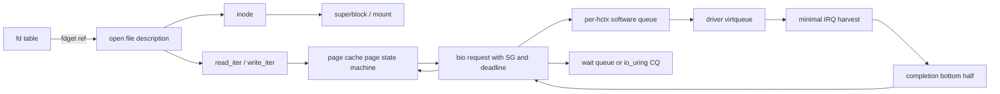

# Concurrent VFS, device, and asynchronous I/O modernization plan

Status: design and implementation plan; the first P0 correctness slice is
implemented and regression-tested, but the target architecture is not yet
fully certified.

### Implementation checkpoint — 2026-09-02

Completed in the first P0 slice:

- atomic process+CPU ownership for `sync_sharedvar`, plus IRQ-save spinlocks;
- structured `createfile()` cleanup and serialized VFS open/close/unmount;
- FAT invalid-cluster/ENOSPC ordering and per-volume metadata serialization;
- generation-safe block-cache dirty clearing;
- SMP-safe virtio queue state and timeout retention until device retirement;
- acquire/release io_uring publication, CQ overflow handling, in-flight
   accounting, and close-time callback draining;
- atomic device registry removal and advisory lock-state changes.

Regression evidence includes `test-io-unit`, a two-process VFS lock-leak test,
io_uring close-with-DMA-in-flight verification, two-vCPU `test-posixio` and
`test-virtio`, `test-spawn`, and `test-integration`.

Still required: full typed device topology/destructors beyond the compatibility
registry, mount/dentry/inode object lifetimes beyond mount pins/global locking,
pinned/kernel-mapped DMA memory, autonomous IRQ bottom halves, and deterministic
in-transfer cache redirty injection. Typed VFS/block/ring descriptor references
and initial scheduler-backed completion waits are now implemented.

### Lifetime and recovery checkpoint — 2026-09-02

The second foundation slice adds referenced device lookup and a registry
`LIVE -> QUIESCING -> DEAD` transition. New operation references are rejected
after quiesce starts, active references drain before the copied operation table
is freed, slot generations are tracked, and block-cache/I/O-manager callback
paths hold references. Registry-wide block flush snapshots referenced devices
and invokes callbacks only after releasing the registry lock. The exported
device-manager interface now exposes additive get/put/remove operations and
correctly declares the legacy pointer-return lookup.

Cache identity now includes the registry-slot generation for pages, writeback,
fills, and cached block size. A transfer carries its referenced device
generation through completion, so removal/re-registration cannot redirect old
data to a replacement device using the same numeric ID.

Mounted VFS roots pin both filesystem and block-device operation tables until
unmount has completed filesystem/cache callbacks. This is an interim adapter,
not the final mount/dentry/inode object model.

One-shot acquire/release completions now replace raw PCB waiter pointers in
virtio-blk and io_uring. A completion-before-wait cannot be lost, and completion
issues a cross-CPU reschedule notification without retaining process storage.
Virtio timeout recovery now resets the device, waits for reset acknowledgement,
fails every outstanding chain exactly once, rebuilds queue ownership, and only
then permits descriptor reuse. A deterministic held-completion fault test
requires a post-reset DMA readback before `VIRTIO_RESET_RECOVERY_OK`.
Failure to acknowledge reset quarantines the queue and its slots permanently;
waiters receive an error, but software never claims that DMA ownership returned.
Hard IRQ only harvests descriptors and sends a reschedule notification.
Successful user read copyback is owner-address-space filtered and drained by the
submitting process; the I/O-manager must not dereference arbitrary user virtual
addresses. Process teardown resets DMA and converts all callbacks owned by the
departing address space, including completed reads, to address-independent error
completion before page-table release.
Ring syscalls hold references against concurrent close, close timeout transfers
final release to the last syscall/completion, and fd allocation uses locked
reserved slots. Other VFS/block fd types still require equivalent object refs.
Mount and unmount share one transaction gate, and the exclusive block-device
claim remains held until filesystem teardown and cache invalidation complete.

Remaining work is narrower but still significant: mount/dentry/inode, process,
request, and DMA-map objects; broader conversion of legacy waits to scheduler
queues; autonomous IRQ bottom halves after user-page pinning/kernel mapping;
hot-unplug destructors and IRQ synchronization; and scalable cache indexes and
page-state locking. io_uring completion waits now use scheduler-backed hashed
event queues, but still harvest callbacks periodically in submitter context.

The generalized device topology, driver lifecycle, IRQ, DMA/IOMMU, hotplug,
module, class-framework, and recovery architecture is specified in
`docs/device-driver-subsystem-architecture.md`. Implement the shared reference,
operation-gate, completion, queue, DMA, and reset primitives once; the block layer
in this document is a consumer of those common contracts.

The common unit, KTAP/TAP, QEMU supervision, SMP stress, fault-injection,
instrumentation, CI, hardware-lab, and release gates needed to verify this plan
are specified in `docs/testing-and-qa-modernization-plan.md`.

## 1. Objective

Evolve the existing storage path into a correct, scalable subsystem for SMP,
multithreaded applications, asynchronous I/O, and production diagnostics while
preserving the existing DEX syscall ABI during migration.

The required end state is:

- correct object lifetime under concurrent open, close, unmount, device removal,
  process exit, cancellation, timeout, and IRQ completion;
- blocking through scheduler wait queues rather than polling or repeated
  `taskswitch()`/`cpu_idle()` loops;
- concurrent access to unrelated files, cache pages, devices, and hardware
  queues without a subsystem-wide lock;
- asynchronous request submission from VFS through the block driver, with
  completion safe on any CPU;
- explicit durability, error, cancellation, and backpressure semantics;
- architecture-neutral atomic, barrier, DMA, and interrupt interfaces suitable
  for a future ARM64 port;
- observability and deterministic fault/stress tests sufficient to qualify the
  subsystem rather than infer correctness from a smoke test.

This plan does not promise Linux ABI compatibility. The Linux-like `bio` and
`io_uring` vocabulary is used where it makes the interfaces familiar, but
ICS-OS owns and documents its ABI.

## 2. Current architecture

### Current contracts observed in source

- `vfs_node` combines namespace identity, inode-like metadata, mount state,
  filesystem-private data, an open counter, and a write lock.
- `file_PCB` combines an open file description, owner PID, current offset, and
  stdio-style buffering. All handles also live on `file_globalopen`.
- The POSIX fd table is embedded in each PCB and points directly to a
  `file_PCB`, block-offset object, or `ics_uring`.
- `dex32_requestIO()` currently calls `bio_submit_sync()` in the caller. The
  older `IOjob` queue and disk-manager dispatch path remain, but normal requests
  are not asynchronously queued through it.
- The block cache contains 512 fixed 4 KiB pages and one global lock.
- Device interfaces are copied into a global table. Callers retain raw pointers
  after the table lock is released.
- virtio-blk owns one virtqueue, three descriptors and one 4 KiB bounce buffer
  per slot. Local interrupt disable is its submission/completion exclusion.
- io_uring memory is kernel-allocated and identity-mapped to the application.
  VFS and RAM-disk operations execute inline; `/dev/vblk` operations use a
  callback associated with a virtio slot.

## 3. Verified findings

Priority meanings: **P0** can corrupt memory/data, deadlock, or use freed
storage; **P1** violates API correctness or prevents safe SMP; **P2** is a
scalability/feature gap to address after the correctness foundation.

### 3.1 Synchronization foundation

| Priority | Source evidence | Failure or cost | Required correction |
|---|---|---|---|
| P0 | `process/sync.c`: `sync_entercrit()` waits on and stores ordinary fields without an atomic read-modify-write or barriers. Re-entry is identified only by PID. | Two CPUs can acquire the same lock. An interrupt in the same PID context is treated as recursive ownership. Every user of `sync_sharedvar`, including VFS, device manager, I/O scheduler, and FAT-adjacent paths, is therefore not SMP-safe. | Introduce spinlock, mutex, rwlock, completion, and wait-queue primitives with defined IRQ rules. Retire `sync_sharedvar` from shared kernel state. |
| P1 | `PCB386.waiting` is both a decrementing sleep counter and a flag cleared by I/O/process wakeups. Several waits loop around `cpu_idle()` or `taskswitch()`. | Wakeups have no condition-lock protocol; cross-CPU wake and timeout races cannot be reasoned about. A halted caller is not represented as a blocked waiter on a specific event. | Add wait queues with `prepare_to_wait`/condition recheck/`finish_wait`, monotonic deadlines, wake-one/all, and reschedule IPI support. Keep sleep timers separate from event state. |
| P1 | Child completion uses fixed `WAITQ_MAX == 8` arrays; producers silently skip insertion when full. Readers and producers do not share a dedicated lock. | Exit status can be lost and concurrent parent/child activity races. | Replace with a locked/unbounded zombie-child list or retain child PCBs until reaped. |

### 3.2 VFS and POSIX descriptors

| Priority | Source evidence | Failure or cost | Required correction |
|---|---|---|---|
| P0 | `openfilex()` checks `locked/opened` and increments `opened` before entering `vfs_busy`; `fclose()` decrements and mutates `file_globalopen` after `file_ok()` releases it. | Concurrent open/close can bypass exclusive-write checks, lose open counts, corrupt the global handle list, or use a handle closed after validation. | Atomic handle acquisition with refcounts; protect node open state and handle-list updates with real locks. Do not use list membership as handle validation. |
| P0 | `createfile()` enters `vfs_busy` and returns without leaving it when a node exists, a name is invalid, or the parent filesystem ID is invalid. | Other PIDs can remain permanently blocked. | Structured single-exit cleanup immediately; later replace global namespace exclusion with scoped directory locks. |
| P0 | Unmount checks `opened` and working directories, then invokes drivers, removes nodes, and frees them without namespace exclusion, references, or an unmount state. | Lookup/open can win the check-to-free window and retain a dangling `vfs_node` or filesystem-private pointer. | Refcounted mount/superblock, dentry, and inode objects; mark mount `DYING`, detach namespace, reject new references, drain active references and writeback, then destroy. |
| P1 | `vfs_directread()` advances the offset before calling the filesystem and returns the requested count without checking the driver result. `vfs_directwrite()` similarly ignores the write callback result before updating size/offset. | Errors become apparent success and offsets/size advance after failed I/O. | Filesystem methods return signed byte counts or `-errno`; update offset and size only from completed bytes. |
| P1 | `sys_preadv()`/`sys_pwritev()` save, change, and restore the shared `file_PCB` offset to emulate positioned I/O. | Another thread sharing the fd can observe or modify the temporary offset; positioned I/O is not atomic. | Add filesystem `read_iter/write_iter` methods taking an explicit position. Never mutate the shared offset for positioned operations. |
| P1 | PCB fd slots have no lock/refcount protocol, and closing an io_uring immediately frees it. | Concurrent syscall/close and process-exit cleanup can use freed file/ring objects. | Per-process fd-table lock; `fdget/fdput`; refcounted open-file descriptions and rings; close detaches the fd first, then drains/cancels asynchronously. |
| P2 | `file_ok()` scans the global open list for every operation. One global list and one VFS lock cover unrelated filesystems/files. | O(system open handles) validation and global serialization. | Direct typed/refcounted handle validation; optional diagnostic handle registry partitioned from the fast path. |
| P2 | Path lookup and directory child lists have no read-side namespace protocol. FAT directory images and node metadata are mutable in place. | Parallel lookup/create/delete/rename cannot be safe or scalable. | Per-directory rwlock and generation counter; ordered two-directory locking for rename; dentry cache with negative entries and RCU-like read optimization only after correctness. |

### 3.3 Filesystem implementations

| Priority | Source evidence | Failure or cost | Required correction |
|---|---|---|---|
| P0 | `fat_addsectors()` calls `fat_write_cluster(fc, ...)` before testing `fc == -1`. | An out-of-space result is used as a cluster index before error handling. | Check allocation before every FAT access and return `-ENOSPC`. Add fault tests for a full volume. |
| P0 | FAT reads, modifies, and writes allocation tables and parent directory buffers without a per-volume allocation/metadata lock. | Concurrent growth/create/delete can allocate one cluster twice or overwrite directory/FAT updates. | Per-superblock allocation lock initially; later finer bitmap/FAT range locks plus transactional metadata ordering. |
| P1 | FAT loads and rewrites broad FAT/directory state during allocation and file growth. | Repeated small appends amplify I/O and serialize metadata work. | Keep validated per-volume allocation state, allocate extents/runs, batch metadata, and expose delayed allocation only after crash semantics are defined. |
| P1 | ISO9660 and other filesystem paths repeatedly poll `dex32_IOcomplete()` with `taskswitch()`, although current submission is usually synchronous. | Obscures error propagation and prevents a clean async stack. | Convert filesystem methods to synchronous wrappers over request completions; add native async iterators only where useful. |

### 3.4 Block cache and block layer

| Priority | Source evidence | Failure or cost | Required correction |
|---|---|---|---|
| P0 | `blkcache_flush()` copies a dirty page, drops `pc_busy` for device I/O, then clears `PC_DIRTY` if the slot still has the same key. It does not detect a write made after the copy. | A concurrent newer write can have its dirty bit cleared after older data reaches disk, so later fsync may omit the new data. | Add page lock, writeback state, dirty generation/sequence, and redirty detection. Clear dirty only for the generation actually written. |
| P1 | `pc_claim()` may place an entry anywhere during its full-table fallback, but `pc_lookup()` searches only eight hash slots. | An installed page may be unreachable, allowing duplicates/stale copies and persistent misses. | Use bucket chains or a real radix/xarray/hash table where insertion and lookup share one indexing contract. |
| P1 | Cache state has only `UPTODATE` and `DIRTY`; there is no refcount/pin, `FILLING`, `WRITEBACK`, error, invalidation, or waiter state. | Duplicate fills occur, eviction/invalidation cannot wait safely, and errors are not retained per page. | Define a page state machine and wait queue; pin pages while copied or submitted. |
| P1 | `pc_dev_rw()` collapses every device result to boolean, and `bio` has one contiguous buffer and only `OK/ERR/PENDING`. | Short I/O and distinct errors are lost; scatter/gather and cancellation cannot be represented. | Signed completion status, residual byte count, request ID, deadline, operation flags, scatter/gather vectors, callback/completion, and cancellation state. |
| P2 | One `pc_busy` protects all cache lookup, copying, aging, dirty accounting, and insertion. Cache capacity is a fixed 2 MiB. | Unrelated devices and pages serialize; cache cannot scale with RAM or workload. | Sharded hash/index locks, per-page locks, per-device dirty lists, dynamic memory-pressure sizing, and per-CPU statistics. |
| P2 | `bio_submit_sync()` executes directly under one per-device `sync_sharedvar`; the advertised job queue is bypassed by normal requests. | No true asynchronous block layer, merging, queue depth control, priorities, or multi-queue dispatch. | One software submission queue per hardware context, async `bio_submit`, sync wait wrapper, merge/split, plugging, fair scheduling, and queue limits. |

### 3.5 Device manager and virtio-blk

| Priority | Source evidence | Failure or cost | Required correction |
|---|---|---|---|
| P0 | Device-table users receive raw pointers after releasing `devmgr_busy`; `devmgr_removedevice()` clears a slot without that lock, drain, reference tracking, or destructor. | Concurrent dispatch/removal can call a stale interface. | Refcounted device object with `PROBING -> LIVE -> QUIESCING -> DEAD` lifecycle and lookup `get/put`. Removal first prevents new I/O, drains/cancels requests, detaches, then releases resources. |
| P1 | Device callbacks can run while the global manager lock is held (`devmgr_sendmessage`, `devmgr_flushblocks`), with interrupts disabled in the send path. | Lock recursion/order is implicit; one slow driver serializes registry operations and may deadlock with IRQ/process paths. | Never invoke driver callbacks under the registry lock. Snapshot referenced devices, release registry lock, then call. Define lock order and IRQ-safe subsets. |
| P1 | `devmgr_interface.devmgr_getdevice` is declared as returning a `devmgr_generic` value while the implementation returns a pointer. | The exported service interface has an incompatible function type. | Version the interface and correct the pointer-return signature; retain a compatibility adapter if any module consumes the old layout. |
| P0 | virtio submission and used-ring harvesting rely on disabling interrupts only on the local CPU while sharing global slot, avail, and used indices. | Two CPUs, or an IRQ on another CPU, can allocate the same slot or corrupt ring indices. | Per-virtqueue IRQ-safe spinlock for indices/slot ownership, or split producer/completion locks with proven ordering. |
| P0 | `virtio_blk_wait()` marks a timed-out slot free although the device still owns the descriptors and DMA buffer. | Late device completion can write into a slot/buffer already reused by another request. | Timeout transitions request to timed-out/cancel-pending but retains descriptors until used-ring completion or device reset. Reset must fail and retire all outstanding requests before reuse. |
| P0 | io_uring close frees `ics_uring` while virtio callbacks retain pointers into `ring->blkcb`; slot waiters retain raw PCB pointers. | Completion after close/process death can dereference freed ring or PCB memory. | Request-owned references to ring, file, process/wait object, and pinned user memory; close/exit cancel and drain before final put. |
| P1 | `virtio_blk_irq()` only harvests and marks slots done. Async callbacks are run by later process-context calls to `virtio_blk_harvest()`/`vblk_finish_async()`. | A submission that returns without a waiting/polling caller has no autonomous process-context completion worker and may not publish its CQE promptly. | IRQ handler only harvests minimal metadata and queues completion work; a per-CPU/per-device bottom half completes requests and wakes waiters. |
| P2 | One virtqueue, fixed three-descriptor requests, 4 KiB bounce buffers, and 4 KiB maximum direct request. | Copies, low maximum transfer size, and no multi-queue CPU locality. | DMA mapping/pinning API, scatter/gather and indirect descriptors, negotiated segment/size limits, queue per CPU or hardware queue, and bounded fallback bounce pools. |
| P1 | No `DEVICE_NEEDS_RESET` handling, queue quiesce, request retry policy, or structured device-error telemetry. | Faults become timeouts or generic `EIO` with no safe recovery. | Reset state machine, retry policy only for idempotent operations, fail-fast writes where outcome is unknown, and counters/event logs. |

### 3.6 io_uring contract

| Priority | Source evidence | Failure or cost | Required correction |
|---|---|---|---|
| P0 | SQ/CQ head and tail fields are ordinary `DWORD`s shared by application, syscall context, and completion context; no acquire/release operations are used. | Producer data may be observed after its tail update, or CQ tail before CQE contents, especially on future ARM64. | Architecture-neutral atomics: SQ tail acquire, SQ head release, CQ head acquire, CQ tail release; document single/multi-producer rules. |
| P0 | CQ insertion does not check available capacity and never increments `cq_overflow`; it overwrites by masked index. | Unconsumed completions can be silently replaced. | Capacity check under completion synchronization; bounded overflow list or backpressure; report overflow deterministically. |
| P1 | Ring memory is a kernel allocation directly exposed through the identity map; SQE addresses are trusted and buffers are not pinned. | No isolation or stable-memory guarantee across asynchronous execution. | Ring mmap object owned by process VM; validate/copy SQEs; pin/map user buffers for request lifetime or require registered buffers until general pinning exists. |
| P1 | `min_complete` uses a polling loop and timeout but timeout is not returned as an error; `flags` is ignored. | API results do not describe whether the wait condition was met. | Block on the CQ wait queue, define signal/timeout behavior, validate flags, and separate submitted count from wait result where ABI permits. |
| P2 | No cancellation, linked operations, fixed files, registered buffers, poll/readiness operations, or per-ring resource accounting. | Insufficient for high-throughput servers and safe teardown. | Add features incrementally after lifecycle and memory ordering are certified. |

## 4. Target architecture and invariants

### Object model

- **Mount/superblock:** owns filesystem instance, device reference, dirty inode
  lists, and lifecycle state.
- **Dentry:** namespace name-to-inode association, parent reference, lookup
  generation, and negative-cache state.
- **Inode:** stable file identity and metadata, refcount, rwlock, mapping/page
  cache, filesystem-private data, and writeback/error state.
- **Open file description:** refcount, access flags, atomic/sequential offset lock,
  and pointer to inode. Fds reference it; duplicated/shared fds therefore share
  an offset intentionally.
- **Device:** immutable identity, operations table, reference count, lifecycle,
  parent/bus relation, and one or more hardware contexts.
- **Bio/request:** explicit ownership from allocation through exactly one terminal
  completion; retains every object and DMA mapping it needs.
- **Ring:** refcounted VM object with explicit owner, limits, CQ wait queue,
  inflight list, overflow handling, and teardown state.

### Non-negotiable invariants

1. Every externally reachable object is either immutable for the access or held
   by a reference protected by a documented lookup protocol.
2. Every request reaches exactly one terminal state: success, error, canceled,
   or reset-failed. Timeout alone never releases device-owned memory.
3. IRQ handlers never sleep, allocate from general heap, call VFS/filesystem
   code, or acquire a lock that process context holds while waiting for that IRQ.
4. No driver callback runs under the device-registry or global namespace lock.
5. Positioned I/O never changes the open file description offset.
6. A page's dirty state is cleared only after the exact dirty generation is
   durably completed; later writers redirty it.
7. `fsync(file)` orders that file's data and required metadata to the device
   flush boundary and returns the first retained writeback error. Unsupported
   durable flush is reported/documented, not silently upgraded to a guarantee.
8. User-published descriptors and kernel-published completions use specified
   acquire/release operations. Device descriptor publication uses the DMA
   barriers required by the architecture and virtio specification.
9. Lock ordering is acyclic and checked in debug builds.

### Initial lock order

The implementation should keep critical sections small and must not require all
levels for common I/O:

1. device registry / mount namespace lock;
2. mount/superblock state lock;
3. parent directory locks in stable inode-ID order;
4. inode metadata rwlock;
5. open-file offset lock;
6. cache index shard lock;
7. page lock;
8. block hardware-context queue lock;
9. driver virtqueue lock.

Locks are released before sleeping for I/O. IRQ completion uses only the
virtqueue lock and completion-queue primitives; it never climbs this order.

## 5. Phased implementation

Each phase must land with tests and diagnostics. Do not start multi-queue or
advanced io_uring work while lifetime and timeout reuse remain unsafe.

### Phase 0 — Freeze contracts and add adversarial tests

1. Define signed byte-count/`-errno` conventions for filesystem, block, and
   driver methods.
2. Add debug assertions for interrupt context, lock ownership, object state,
   request double completion, and refcount underflow.
3. Add deterministic fault injection at allocation, block submit, device
   completion, flush, and timeout boundaries.
4. Add SMP tests for concurrent open/close, positioned I/O versus sequential
   I/O, create/delete/rename, full FAT volume, ring close with inflight I/O,
   delayed virtio completion, CQ saturation, and process exit during I/O.

Gate: tests reproduce the P0 scenarios or are marked expected-fail with issue
IDs; baseline smoke tests remain green.

### Phase 1 — Correct synchronization and waiting primitives

1. Implement IRQ-safe spinlocks, sleeping mutexes, rwlocks, refcounts, atomics,
   completions, monotonic deadlines, and condition-based wait queues.
2. Add cross-CPU wake/reschedule IPI and make scheduler blocked/runnable
   transitions atomic under the ready-queue protocol.
3. Replace `sync_sharedvar` first in device manager, VFS, I/O scheduler, block
   cache, and FAT metadata paths.
4. Replace `PCB386.waiting` event uses and fixed child completion arrays.

Gate: lock/atomic litmus tests and 2/4/8-vCPU contention stress run without lost
wakeups, duplicate scheduling, deadlock, or wait-status loss.

### Phase 2 — VFS lifetime and POSIX semantics

1. Introduce refcounted mount, dentry, inode, and open-file objects behind
   compatibility adapters for `vfs_node`/`file_PCB` callers.
2. Implement fd-table `fdget/fdput`, detach-on-close, shared open-file offsets,
   and explicit-position iterators.
3. Make lookup/create/unlink/rename/unmount obey namespace and object-lifetime
   protocols. Fix all early-return lock leaks and checked error propagation.
4. Add per-superblock FAT metadata serialization; correct ENOSPC ordering;
   preserve ISO9660 read-only behavior.

Gate: POSIX error/short-I/O tests, concurrent namespace stress, unmount/open
race, and shared-fd offset tests pass under SMP and fault injection.

### Phase 3 — Asynchronous block core and correct page cache

1. Replace boolean `bio` with refcounted request + scatter/gather + callback or
   completion + deadline/cancel state.
2. Implement per-device hardware contexts, bounded queues, merge/split, queue
   backpressure, sync wrappers, and fair dispatch.
3. Replace the cache index with a scalable shared index and per-page state
   machine; add fill coalescing, pinning, generation-safe writeback, retained
   errors, dirty lists, and device invalidation/drain.
4. Size cache from available memory and reclaim clean pages under pressure.

Gate: concurrent cached read/write/fsync, redirty-during-writeback, eviction,
short/error I/O, pressure, and multi-device isolation tests pass. Collect
throughput, IOPS, latency percentiles, cache hit/miss, queue depth, merges, and
CPU-time baselines; set numeric gates only from those measured baselines.

### Phase 4 — virtio-blk lifecycle, DMA, and completion

1. Add virtqueue locks and request ownership independent of caller lifetime.
2. Add IRQ-to-bottom-half completion queues and cross-CPU waiter wakeups.
3. Add DMA map/unmap and user-page pin APIs; support SG/indirect descriptors and
   negotiated transfer limits. Keep bounce buffering as a bounded fallback.
4. Add safe timeout/reset/quiesce/drain; process `DEVICE_NEEDS_RESET`; define
   retry rules and unknown-write-outcome errors.
5. Add per-CPU/hardware virtqueues where negotiated and useful.

Gate: delayed/lost/duplicate/error completions, reset with inflight reads and
writes, queue saturation, multi-CPU submission, large SG I/O, readonly and
capacity boundaries all pass without descriptor reuse or leaks.

### Phase 5 — io_uring v2

1. Implement VM-owned ring mappings and acquire/release ring operations.
2. Protect CQ publication, enforce capacity, and implement overflow/backpressure.
3. Reference every ring/file/buffer until completion; close and process exit
   cancel/drain safely.
4. Block `enter(GETEVENTS)` on a CQ wait queue with precise timeout/signal result.
5. Add, in order: registered buffers, fixed files, async cancel, linked SQEs,
   poll/readiness, and optional SQ polling. Advertise each feature bit only
   when its tests pass.

Gate: producer/consumer memory-order tests on x86-64 and ARM64 model/emulation,
ring saturation, cancellation races, close/exit, linked failure propagation,
and sustained multi-ring SMP stress pass.

### Phase 6 — filesystem scalability and durability

1. Convert FAT metadata operations to cached allocation state and batched,
   ordered updates; define recoverability limits or add a small intent log.
2. Add generic writeback workers, dirty throttling, per-inode fsync, and mount
   sync/unmount drain.
3. Separate filesystem page cache from raw block aliases or define explicit
   invalidation so direct/raw writes cannot leave stale file pages.
4. Add direct-I/O alignment/coherency rules and asynchronous filesystem iterators.

Gate: persistent-disk reboot tests after ordered fault points, fsync durability,
full-volume recovery, concurrent create/grow/delete, and raw/file coherency pass.

### Phase 7 — production qualification and tuning

1. Add tracepoints for syscall-to-CQE/request latency, queueing, dispatch,
   completion, cache state changes, writeback, reset, and cancellation.
2. Export per-CPU/per-device counters and bounded recent-error records through a
   stable diagnostics interface and serial summaries for headless CI.
3. Add soak, randomized fault, memory-pressure, SMP scaling, and crash/reboot
   suites. Run with 1/2/4/8 CPUs and multiple devices/queues.
4. Tune sharding, queue depth, batching, interrupt moderation, cache sizing, and
   writeback from measurements. Never encode unmeasured performance claims.
5. Remove compatibility paths only after all callers migrate and capability
   tests pass.

Gate: published qualification matrix and reproducible artifacts for correctness,
durability, scaling, fault recovery, resource bounds, and capability regression.

## 6. Test matrix additions

| Test | Primary assertions |
|---|---|
| `test-lock-smp` | mutual exclusion, IRQ-safe nesting rules, acquire/release visibility |
| `test-vfs-race` | shared-fd offsets, preadv isolation, open/close/unlink/rename/unmount lifetime |
| `test-fat-full` | `ENOSPC` before FAT access; no metadata corruption |
| `test-cache-race` | fill coalescing, redirty during writeback, fsync error retention, invalidation drain |
| `test-bio-async` | exactly-once completion, cancel/timeout races, short/error propagation, backpressure |
| `test-virtio-smp` | concurrent submit/complete on multiple CPUs and queues; reset/drain safety |
| `test-uring-race` | memory ordering, overflow, close/exit inflight, cancellation, linked SQEs |
| `test-fsync-durable` | persistent image survives reboot at controlled post-flush fault points |
| `test-io-soak` | bounded memory/requests and no deadlock or corruption over sustained mixed load |

Existing `test-boot`, `test-smp`, `test-exec`, `test-iobench`, `test-virtio`,
`test-posixio`, `test-spawn`, and `test-integration` remain mandatory regression
gates. Current `test-posixio` and `test-virtio` are useful functional smoke tests,
but both run with `-smp 1`; they do not certify the concurrency contracts above.

## 7. Observability requirements

Minimum counters:

- VFS: lookup hit/miss, active mount/inode/file refs, lock contention, short/error
  I/O, fsync count/latency/error;
- cache: lookup/fill/coalesced fill, clean/dirty/writeback pages, redirty,
  eviction, stalls, writeback errors;
- block: queued/inflight/completed/canceled/timed-out/reset-failed, bytes, merges,
  queue-depth high water, latency histogram;
- virtio: avail/used indices, free descriptors, IRQs, bottom-half batches,
  bounce/SG bytes, status errors, resets;
- io_uring: SQ submitted/dropped, CQ published/overflowed, inflight, canceled,
  fixed-file/buffer usage, wait wakeups/timeouts.

Trace events use monotonic timestamps, CPU ID, PID, device/queue ID, request ID,
operation, byte range, state transition, and result. Trace buffers must be
bounded, per-CPU where possible, and safe to inspect after a fault.

## 8. Rollout and compatibility

- Keep existing DEX entry points as wrappers while internal contracts change.
- Version device and filesystem operations tables using size plus explicit
  version/capability fields; do not silently reinterpret existing layouts.
- Migrate one block driver and one filesystem first (virtio-blk + FAT), retain
  ATA/ISO adapters, then migrate remaining drivers.
- Provide build-time debug mode with lockdep-like checks, poisoning, request
  leak tracking, and aggressive fault injection; production mode retains cheap
  assertions and counters.
- Every phase is independently revertible. On a failed gate, preserve the new
  tests and revert the implementation rather than weakening the invariant.

## 9. Immediate work order

1. Fix `createfile()` lock leaks and FAT `fc == -1` ordering with regression
   tests.
2. Land real spinlock/mutex/refcount/completion/wait-queue foundations and
   convert the device registry and virtio queue.
3. Prevent virtio timeout descriptor reuse and drain io_uring inflight requests
   on close/exit.
4. Add CQ capacity checks and acquire/release ring publication.
5. Fix VFS handle/node lifetime and explicit-position I/O.
6. Fix cache lookup indexing and generation-safe writeback.
7. Introduce the async block request core; then proceed through Phases 4–7.

This ordering removes known corruption and use-after-free risks before pursuing
throughput features such as multi-queue, zero-copy, and SQ polling.
